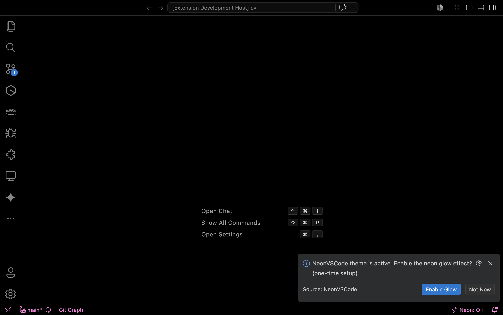
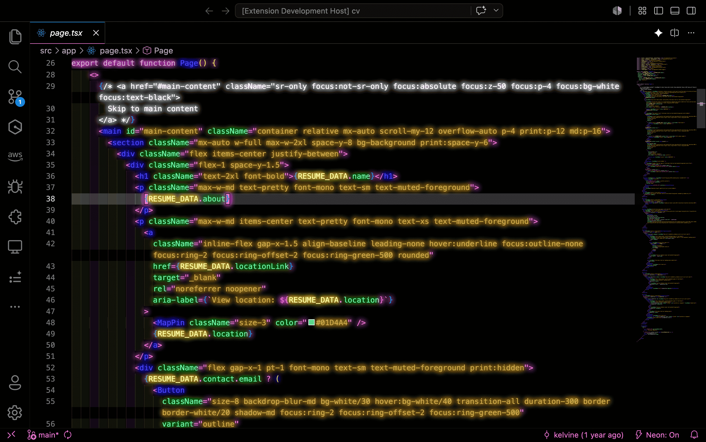

# 🖥 NeonVSCode

**Tokyo Nights, OLED Blacks, and Neon Glow.**

NeonVSCode is a high-contrast, vibrant dark theme for Visual Studio Code. Originally born as the popular NeonCode theme for Adobe Brackets, it has been completely rebuilt for VS Code with **True OLED Black (#000000)** optimization and modernized syntax highlighting.

## ✨ Features

*   **True OLED Black:** Backgrounds are set to `#000000` for infinite contrast on OLED and LED displays.
*   **Vibrant Neon Palette:** Electric blues, purples, and cyans inspired by cyberpunk aesthetics.
*   **Highly Readable:** Despite the neon aesthetic, colors are carefully picked to maintain high legibility during long coding sessions.
*   **Semantic Highlighting:** Fully supports modern VS Code semantic tokens for a more accurate coding experience.

## 📸 Preview


*The theme in full effect with Neon Glow enabled.*

## � Installation

1. Open **Visual Studio Code**.
2. Go to **View > Extensions**.
3. Search for `NeonVSCode`.
4. Click **Install**.
5. Go to **File > Preferences > Theme > Color Theme** and select **NeonVSCode**.


*NeonVSCode standard UI after activation.*

## ⌨️ Commands & Configuration

This theme includes built-in commands to manage the neon aesthetic:

*   `NeonVSCode: Enable Neon Glow`: Activates enhanced glowing effects.
*   `NeonVSCode: Disable Neon Glow`: Reverts to a standard flat neon look.

**Pro Tip:** Look for the ⚡️ **Neon: On/Off** button in your Status Bar (bottom right) for a one-click toggle!

### ⚠️ Dealing with the "Unsupported" Warning
Because this extension modifies internal VS Code files to inject the neon glow script, VS Code may display a notification stating that your installation is "Unsupported" or "Corrupt". This is standard behavior for any extension that modifies the UI layer (like SynthWave '84). It is safe to ignore. To remove this warning and the "Unsupported" text in the title bar, we recommend installing the **Fix VSCode Checksums** extension.

### Settings
You can toggle the glow effect permanently in your `settings.json`:
```json
"neonvscode.disableGlow": false
```

## 📸 Screenshots

| Language | Preview |
| :--- | :--- |
| **JavaScript** | *Included in main preview* |
| **Python** | *Coming soon* |
| **HTML** | *Included in main preview* |

## 🛠 Compatibility

NeonVSCode is compatible with:
*   Visual Studio Code v1.74.0+
*   VSCodium
*   GitHub Codespaces
*   Cursor-based editors that support VS Code themes
*   Antigravity coding environments (just kidding, but it looks that good!)

## 📄 License

This project is licensed under the MIT License.
